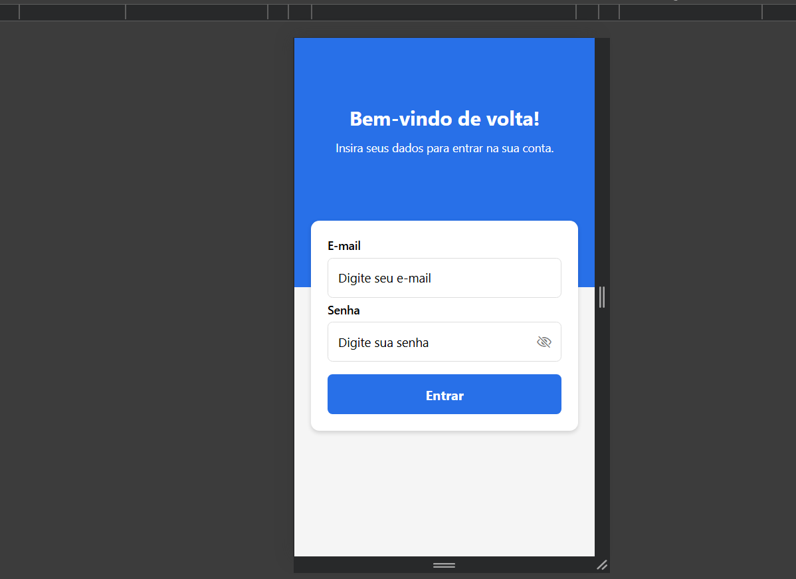
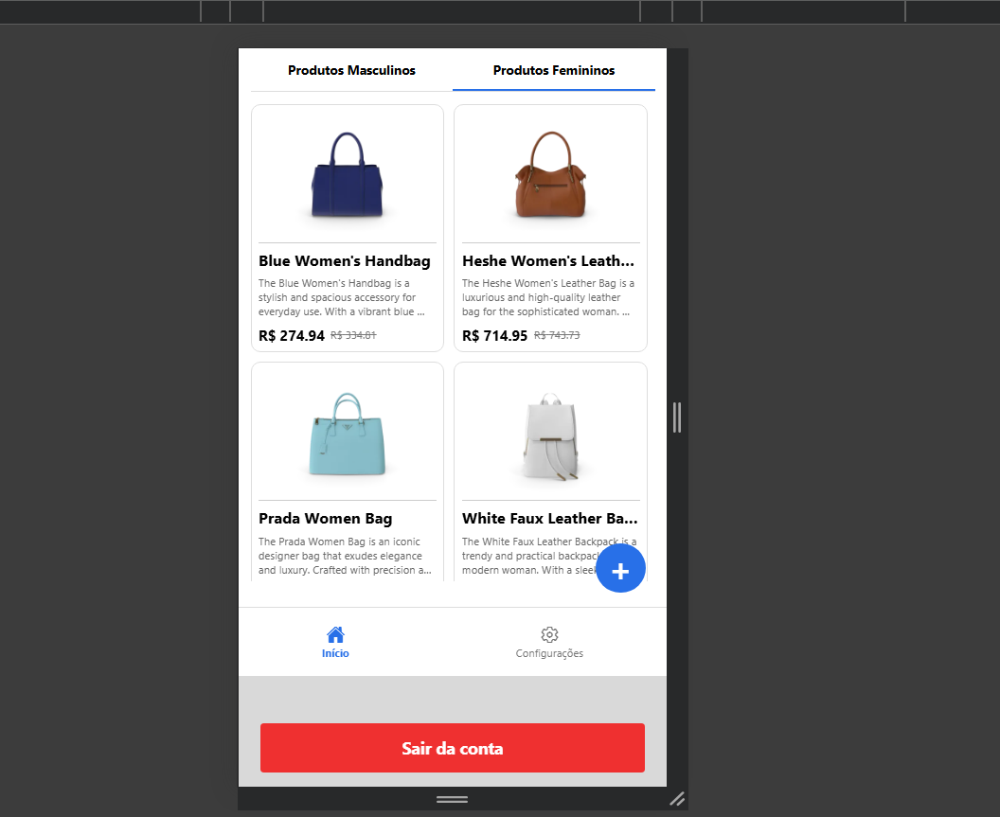
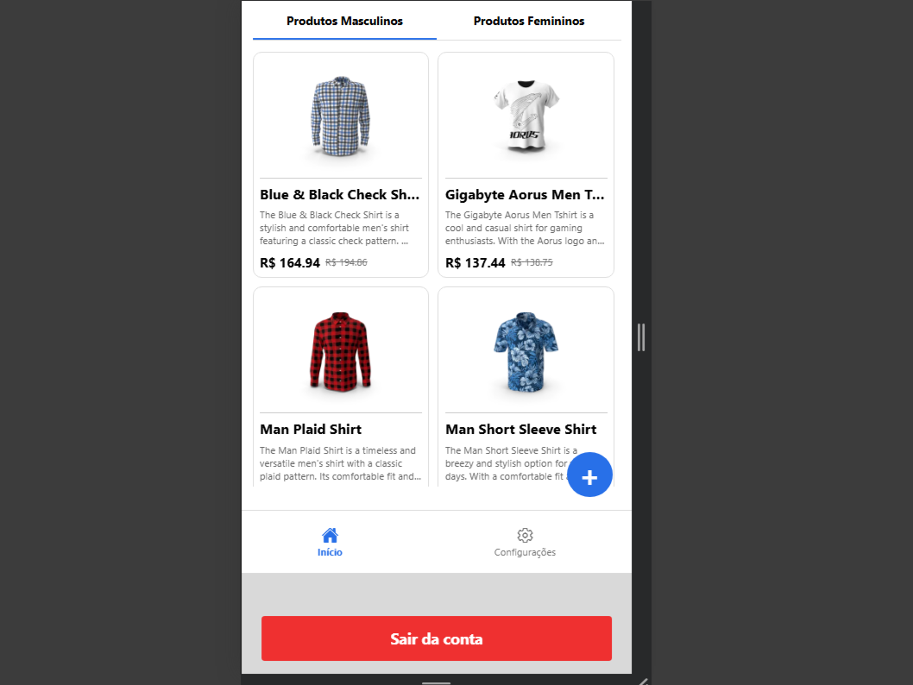
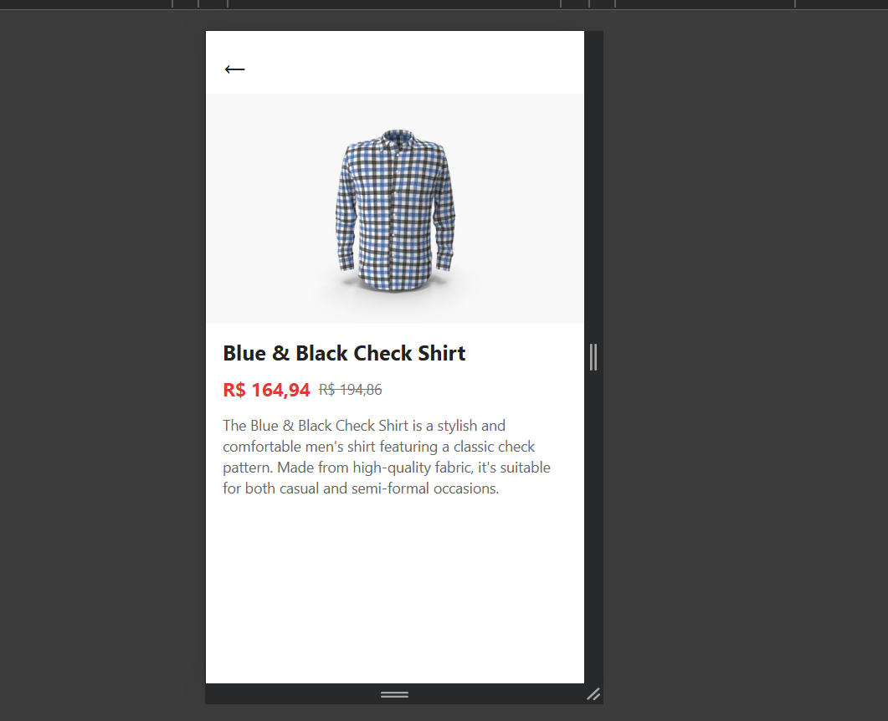
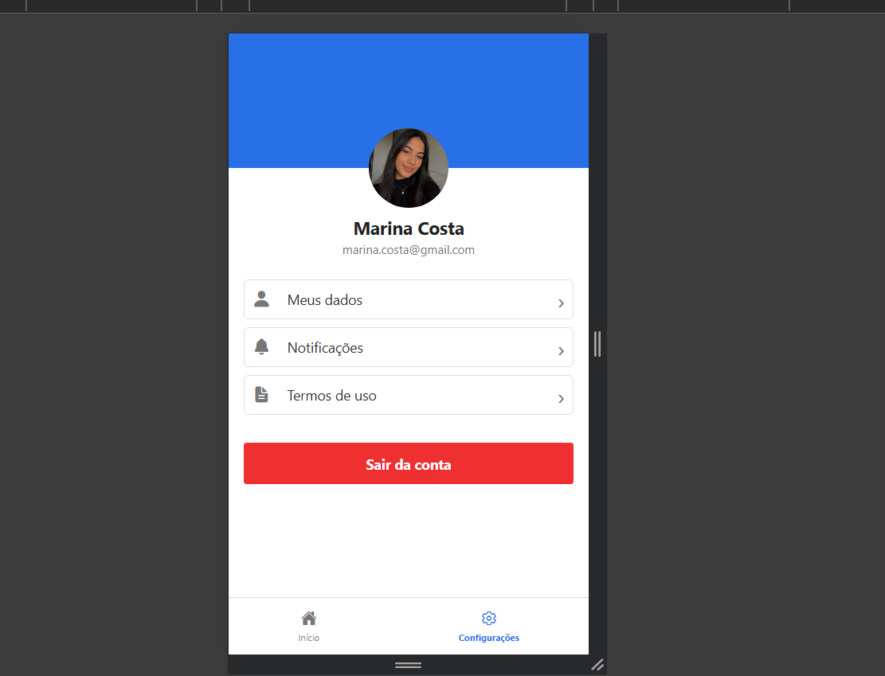
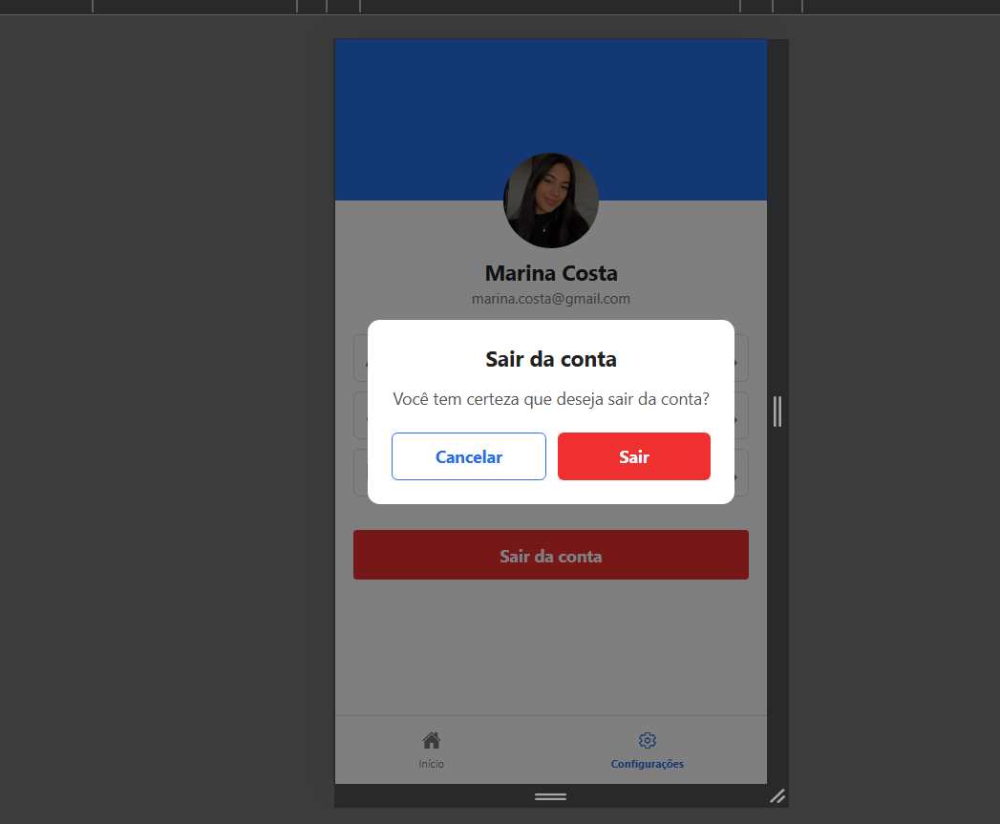

# Catálogo Interativo Mobile com Listagem de Produtos por Categoria

Aplicativo mobile desenvolvido com React Native e Expo para apresentar produtos de uma loja online, organizados por categorias masculina e feminina.

A aplicação permite realizar login, visualizar a lista de produtos, navegar entre categorias, selecionar um produto para consultar seus detalhes, acessar a tela de configurações e realizar o logout.

O projeto utiliza uma API REST pública para obtenção dos dados dos produtos e aplica conceitos de navegação entre telas, consumo de API e gerenciamento de estado.

## Funcionalidades

- Tela de login com validação dos campos de e-mail e senha.
- Armazenamento temporário dos dados do usuário utilizando Redux Toolkit.
- Tela de listagem de produtos organizada por categorias masculina e feminina.
- Consumo de dados de uma API REST utilizando Axios.
- Navegação para a tela de detalhes de cada produto.
- Tela de detalhes contendo nome, imagem, descrição, preço e desconto.
- Tela de configurações da aplicação.
- Opção de sair da conta.
- Retorno à tela de login após o logout.

## Tecnologias utilizadas

### React Native

Utilizado para o desenvolvimento da aplicação mobile e construção das interfaces das telas.

### Expo

Utilizado como plataforma e ambiente de desenvolvimento para executar o projeto React Native.

### TypeScript

Utilizado para adicionar tipagem ao código e facilitar a organização e manutenção do projeto.

### Axios

Utilizado para realizar as requisições HTTP e consumir os dados disponibilizados pela API REST.

### Redux Toolkit

Utilizado para o gerenciamento do estado relacionado ao usuário, armazenando temporariamente o e-mail e a situação de login.

### Expo Router

Utilizado para realizar a navegação entre as telas da aplicação por meio de rotas baseadas nos arquivos do projeto.

## API utilizada

O aplicativo utiliza a API REST pública DummyJSON para obter os dados dos produtos apresentados na aplicação.

### Listagem de produtos por categoria

A busca dos produtos é realizada por meio do endpoint:

```text
https://dummyjson.com/products/category/{categoria}
```

As categorias utilizadas no projeto são:

**Masculinas:**

- `mens-shirts`
- `mens-shoes`
- `mens-watches`

**Femininas:**

- `womens-bags`
- `womens-dresses`
- `womens-jewellery`
- `womens-shoes`
- `womens-watches`

### Detalhes do produto

Para apresentar as informações de um produto específico, a aplicação utiliza o ID do produto no endpoint:

```text
https://dummyjson.com/products/{id}
```

A partir dessa consulta, são apresentados na tela de detalhes o nome, a imagem, a descrição, o preço e o percentual de desconto do produto.

## Funcionamento da aplicação

A aplicação inicia na tela de login, onde o usuário informa seu e-mail e senha. Após a validação dos campos, o usuário é direcionado para a tela de produtos.

Na tela de produtos, os itens são apresentados de acordo com as categorias masculina e feminina. O usuário pode selecionar um produto para acessar sua tela de detalhes, onde são exibidas informações como nome, imagem, descrição, preço e desconto.

A aplicação também possui uma tela de configurações, com opções relacionadas à conta e ao aplicativo.

Para encerrar a sessão, o usuário pode utilizar a opção de sair da conta. Após a confirmação, o estado de login é encerrado e o usuário retorna para a tela inicial.

## Estrutura do projeto

A estrutura principal do projeto está organizada da seguinte forma:

- `app/` — contém as telas da aplicação e as configurações de navegação.
  - `_layout.tsx` — configura a estrutura de navegação da aplicação.
  - `index.tsx` — tela de login.
  - `produtos.tsx` — tela de listagem dos produtos e categorias.
  - `detalhes.tsx` — tela de detalhes do produto selecionado.
  - `configuracoes.tsx` — tela de configurações da aplicação.
- `store/` — contém o gerenciamento de estado global da aplicação.
  - `store.ts` — configuração do Redux Toolkit e gerenciamento do estado do usuário.
- `assets/` — contém imagens e outros recursos utilizados pelo projeto.
- `package.json` — contém as dependências e configurações do projeto.
- `README.md` — documentação do projeto.

## Instalação e execução

Para executar o projeto localmente, é necessário ter o Node.js instalado.

### 1. Instalar as dependências

Após clonar ou baixar o projeto, abra o terminal na pasta principal do projeto e execute:

```bash
npm install
```

Esse comando instala as dependências necessárias para executar a aplicação.

### 2. Iniciar o projeto

Após a instalação das dependências, execute:

```bash
npx expo start
```

O Expo iniciará o projeto e disponibilizará as opções de execução da aplicação.

### 3. Executar a aplicação

Após executar o comando `npx expo start`, é possível utilizar as opções disponibilizadas pelo Expo para executar o aplicativo em:

- Navegador web;
- Emulador Android;
- Simulador iOS;
- Dispositivo físico compatível com o Expo Go.

Para executar diretamente no navegador web, também pode ser utilizado:

```bash
npx expo start --web
```

## Fluxo da aplicação

O funcionamento da aplicação segue o seguinte fluxo:

1. O usuário acessa a tela inicial de login.
2. Informa o e-mail e a senha.
3. O sistema realiza a validação dos campos informados.
4. Após o login, o usuário é direcionado para a tela de produtos.
5. Na tela de produtos, o usuário pode navegar entre as categorias masculina e feminina.
6. A aplicação consulta a API e apresenta os produtos correspondentes à categoria selecionada.
7. Ao selecionar um produto, o usuário é direcionado para a tela de detalhes.
8. A tela de detalhes apresenta as informações do produto, como nome, imagem, descrição, preço e desconto.
9. O usuário pode acessar a tela de configurações.
10. Para encerrar a sessão, o usuário seleciona a opção de sair da conta.
11. Após a confirmação da saída, o estado de login é encerrado e o usuário retorna para a tela inicial.

## Gerenciamento de estado com Redux Toolkit

O Redux Toolkit é utilizado no projeto para realizar o gerenciamento do estado relacionado ao usuário durante a utilização da aplicação.

O estado possui duas informações principais:

- `email` — armazena temporariamente o e-mail informado durante o login.
- `logado` — indica se o usuário está conectado à aplicação.

O projeto possui duas ações principais:

- `login` — recebe o e-mail informado, armazena essa informação e altera o estado de login para verdadeiro.
- `logout` — limpa o e-mail armazenado e altera o estado de login para falso.

Dessa forma, o Redux Toolkit centraliza o estado de autenticação utilizado pela aplicação e permite controlar o acesso e o encerramento da sessão do usuário.

## Prints da aplicação

A seguir são apresentados prints das principais telas do aplicativo, demonstrando a interface desenvolvida e o fluxo de navegação.

### Tela de Login

Tela inicial da aplicação, utilizada para realizar o acesso do usuário por meio de e-mail e senha.



### Tela de Produtos

Tela principal do aplicativo, responsável pela apresentação dos produtos e organização por categorias masculina e feminina.





### Tela de Detalhes

Tela que apresenta as informações detalhadas de um produto selecionado, incluindo nome, imagem, descrição, preço e desconto.



### Tela de Configurações

Tela destinada às configurações e opções relacionadas à conta do usuário.



### Sair da Conta

Modal de confirmação utilizado para encerrar a sessão do usuário e retornar à tela de login.



## Consumo da API com Axios

O Axios é utilizado no projeto para realizar as requisições HTTP à API REST pública DummyJSON.

Na tela de produtos, a aplicação realiza requisições de acordo com a categoria selecionada e utiliza os dados retornados pela API para apresentar os produtos.

Na tela de detalhes, o ID do produto selecionado é utilizado para realizar uma nova requisição e obter suas informações específicas.

As informações recebidas da API são utilizadas para apresentar os dados dos produtos na interface, como nome, imagem, descrição, preço e desconto.

A utilização do Axios permite realizar a comunicação entre o aplicativo e a API de forma organizada, facilitando o tratamento das requisições e dos dados recebidos.

## Considerações finais

O desenvolvimento deste projeto permitiu aplicar, de forma prática, conceitos de desenvolvimento mobile utilizando React Native e Expo.

A aplicação integra navegação entre telas, consumo de uma API REST por meio do Axios e gerenciamento de estado com Redux Toolkit.

O projeto também possibilitou trabalhar com a organização de produtos por categorias, apresentação de informações detalhadas e construção de uma interface seguindo o layout proposto no Figma.

A experiência contribuiu para o desenvolvimento de conhecimentos relacionados à estruturação de aplicações mobile, navegação entre telas, consumo de APIs e gerenciamento de estado.